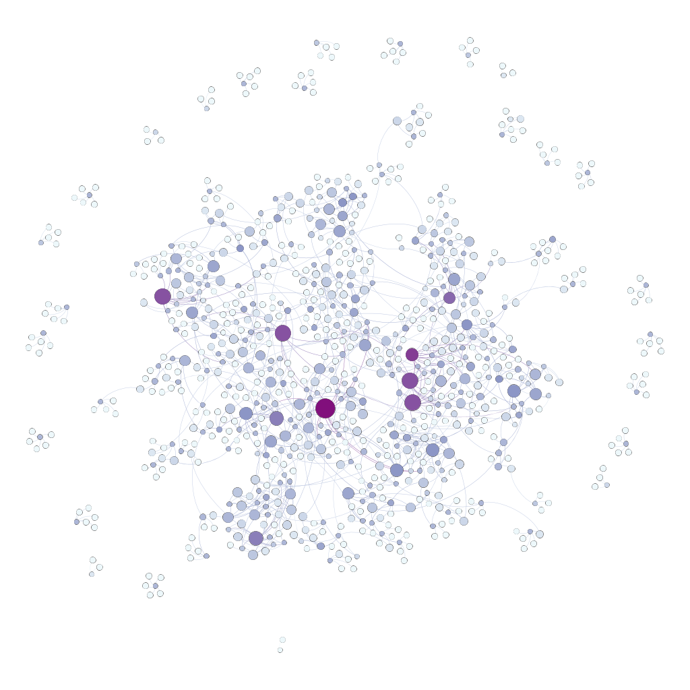

# Visualizing-Movie-Relationships-within-The-Movie-DB
Pulled, transformed and cleaned data from the movie DB API to create a database of similar movies and then visualized movie similarity as a network of nodes

The graph displays the relationships between similar movies, the bigger and more purple a node is the higher its degree

